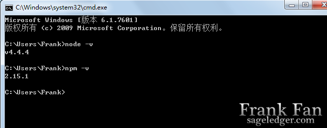
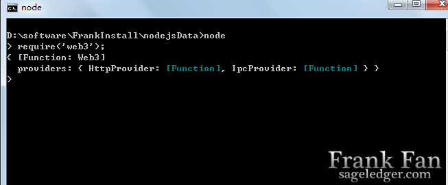
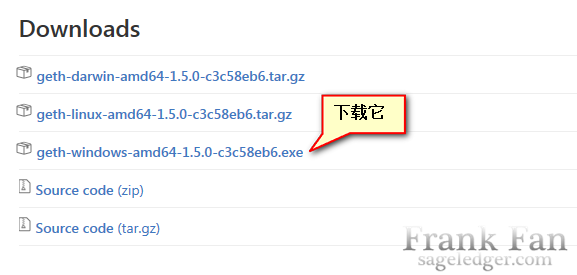
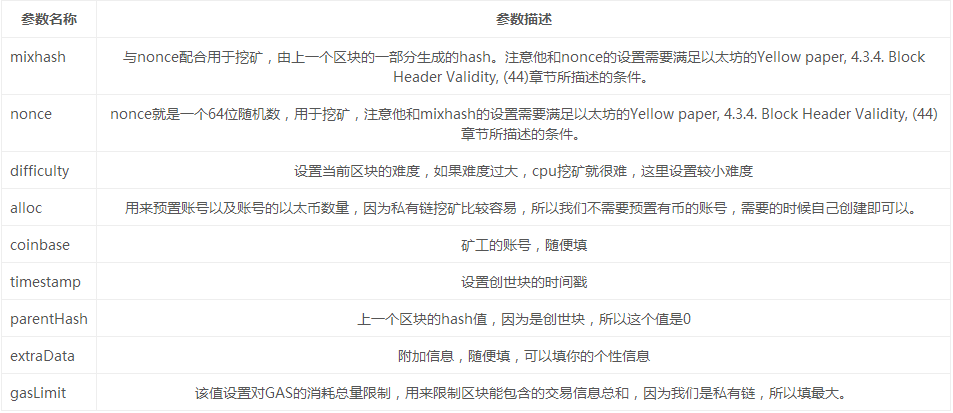
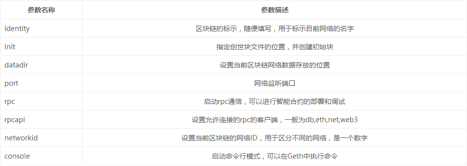
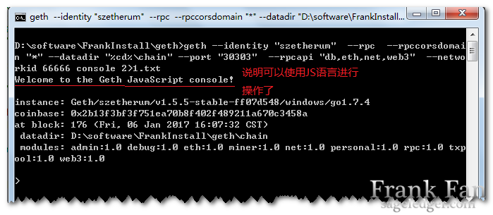
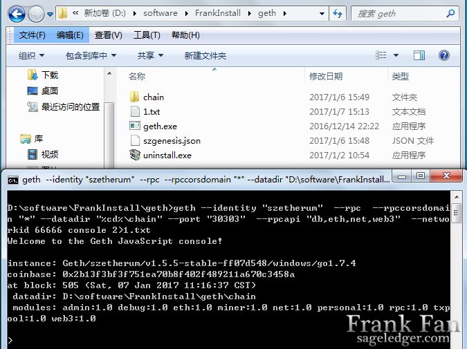
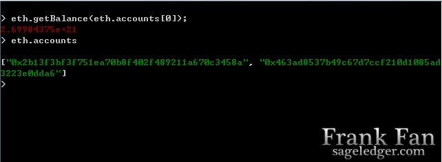
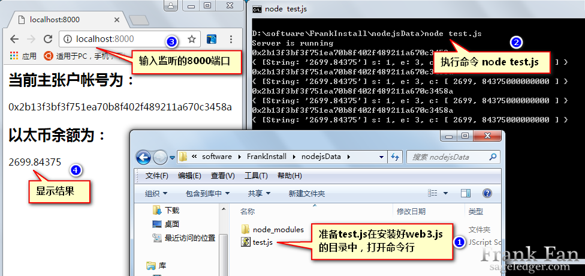

#Lesson1 以太坊开发环境搭建
本课程带你用最精简的方式实现一些区块链的功能，帮你迅速打开前后端，感受以太坊。实现的功能和官方提供的truffle实现的功能类似，在浏览器中显示当前节点主账户和账户余额。(先使用此版本安装，同步已有的区块链数据，待连接节点时，即可同步数据，geth版本更新后，只需要将数据拷贝到chain的data中,md后缀的文件，是使用markdown2，进行编辑的)。
以太坊开发使用nodejs软件开发语言，作为javascript的服务端解释器，express是web应用框架，npm是Nodejs的包管理器。npm的功能实现依赖git。web3.js是以太坊暴漏给Dapp开发人员的和以太坊交互的接口。里面有基本所有和区块链相关的方法，详情看首页参考博客：http://me.tryblockchain.org。git用于版本管理，下载源代码等等，类似于svn。

## 一、 安装 node.js npm ##
在windows操作系统中安装node.js很方便，并且集成了npm，无需再特意安装npm。只需要从官网下载，小编使用的是4.4.4版，地址为：
[node.js中文网：http://nodejs.cn/](http://nodejs.cn/)
安装结束后，使用win键+R启动cmd，输入node -v/npm -v验证是否成功安装，如果成功会分别显示两个软件的版本号，如图所示：

## 二 、安装git ##
git的安装很简单，直接从git的官网，下载，选择相应的位，32/64Bit,点击安装即可：[https://www.git-scm.com/](https://www.git-scm.com/)

## 三 、下载web3.js ##
如果你只是准备启动私链，测试，并不获取数据，做区块连的开发，可以跳过这一步，如果是区块连开发人员，请确保你的web3.js准确安装，并进行测试。web3.js的源码可以在，github上查找，简单的浏览API，也可以找到安装步骤。[https://github.com/ethereum/web3.js](https://github.com/ethereum/web3.js)
1.首先创建一个存放node.js项目的文件夹,小编的在D盘的nodejsData下，进入此目录按shift键点击鼠标右键，选择打开命令行，进入cmd。输入命令：

    npm install web3

等待下完成后，输入命令 node 进入node.js，执行

     require('web3')

回车，如果显示，以下图示，说明安装成功：

## 四 、下载geth客户端##
Windows必须64位系统，从官方网站下载编译好的win64客户端，解压缩即可运行，往下翻，在比较靠下的位置，下载地址如下：

   [ https://github.com/ethereum/go-ethereum/releases/]( https://github.com/ethereum/go-ethereum/releases/)

下载后，只有一个Geth.exe的文件。

安装图像化客户端Mist，依然是从官方地址下载编译好的客户端即可，下载地址：

   [ https://github.com/ethereum/mist/releases/]( https://github.com/ethereum/mist/releases/)

下载解压缩后，Ethereum-Wallet即为以太坊图形化界面。

## 五、 准备创世块 ##
建立geth文件夹，存储区块数据，在此文件夹中创建创世区块，编译创建创世区块所需要的脚本， 注意alloc下的key需要和上述的账号保持一致（起初应该将alloc清空,并命名为你想要的名字，如：szgenesis.json ）。

	    {
		  "nonce": "0x0000000000000042",
		  "difficulty": "0x200000",
		  "mixhash": "0x0000000000000000000000000000000000000000000000000000000000000000",
		  "coinbase": "0x0000000000000000000000000000000000000000",
		  "timestamp": "0x00",
		  "parentHash": "0x0000000000000000000000000000000000000000000000000000000000000000",
		  "extraData": "0x",
		  "gasLimit": "0x2CD29C0",
		  "alloc": {},
		  "config": {
	        "chainId": 6500,
	        "homesteadBlock": 0,
	        "eip155Block": 0,
	        "eip158Block": 0
	    }
	   }

## 六、 创建数据存放地址并初始化创世块##
进入Windows下D:/geth的目录 ，放置配置好的szgenesis.json文件，执行如下命令：

    geth  --datadir "chain" init szgenesis.json 

在命令执行目录中，会自动创建一个chain目录，里面会有两个子文件夹，chaindata存放所有区块数据，keyStore会存放此节点下的所有账户文件。
## 七、 启动私链  ##
进入Windows下D:/geth的目录,打开cmd执行如下命令：

    geth --identity "szetherum"  --rpc  --rpccorsdomain "*" --datadir "chain" --port "30303"  --rpcapi "db,eth,net,web3,personal,miner"  --networkid 6500 console 2>1.txt

看到如下画面说明，私有链启动成功。

## 八、 创建账户##

    personal.newAccount('123');
    "0xea5c99831c2e4a0e094facdbac1befcf6c92e543"

## 九、 启动官方钱包 ##

启动Windows下私有链图形节点，首先按上面的步骤启动Geth并创建了账号，
然后解压缩Ethereum-Wallet，运行Ethereum-Wallet.exe,即启动成功，
如果区块链正常的话，会在右上角显示“PRIVATE-NET”，点击“LAUNCH APPLICATION”
进入图形界面即可。

## 十、 连接其他节点 ##
首先要知道自己的节点信息，在Geth命令行界面下输入命令,注意大小写

    admin.nodeInfo

系统会显示

    enode:"enode://1e3c1727cd3bee9f25edeb5dbb3b880e03e41f8eec99566557f3ee0422734a8fcad17c161aa93d61bdbfb28ed152c143c7eb501db58bc63502a104a84b62d742@0.0.0.0:30303“

其中

    enode://1e3c1727cd3bee9f25edeb5dbb3b880e03e41f8eec99566557f3ee0422734a8fcad17c161aa93d61bdbfb28ed152c143c7eb501db58bc63502a104a84b62d742@0.0.0.0:30303

就是自己节点的信息，在连接节点时，主节点必须先挖矿才能连接其他节点，注意要把“0.0.0.0“换成你自己的IP。将这个信息发送给其他节点，在其他节点的命令行中输入：

    admin.addPeer(‘enode://1e3c1727cd3bee9f25edeb5dbb3b880e03e41f8eec99566557f3ee0422734a8fcad17c161aa93d61bdbfb28ed152c143c7eb501db58bc63502a104a84b62d742@192.168.1.101:30303’)
    
如果添加成功，输入admin.peers会显示出新添加的节点。

## 十一、 测试私链是否存在数据 ##
使用命令，或者在图形化界面中观察，区块数，以太币数量，是否增加，在创建的geth目录下，cmd 命令行。

1.重新启动私链

    geth --identity "szetherum"  --rpc  --rpccorsdomain "*" --datadir "chain" --port "30303"  --rpcapi "db,eth,net,web3,personal,miner"  --networkid 6500 console 2>1.txt

文件夹以及命令行图示，如图：

2.启动查看节点的帐号，以及余额：

    eth.accounts

显示结果如图：

## 十二、 准备test.js进行浏览器数据显示 ##
1.准备test.js文件，保存在安装过web3.js模块的项目目录中，代码如下：

    var http = require('http');
    http.createServer(function(req,res){
	res.writeHead(200,{'Content-Type':'text/html;charset=utf-8'});
	var Web3 = require('web3');
	var web3 = new Web3();
	web3.setProvider(new web3.providers.HttpProvider('http://localhost:8545'));
	console.log(web3.eth.accounts[0]);
	var balance = web3.fromWei(web3.eth.getBalance(web3.eth.accounts[0]),'ether');
	console.log(balance);
	res.write('<h2>');
	res.write('当前主账户帐号为：');
	res.write('</h1>');
	res.write('
');
	res.write(web3.eth.accounts[0].toString());
	res.write('
');
	res.write('<h2>');
	res.write('以太币余额为：');
	res.write('</h1>');
	res.write('
');
	res.write(balance.toString());
	res.write('
');
	res.end();
    }).listen(8000);//监听8000端口
    console.log('Server is running');

2.在该目录下，打开cmd 敲击命令

	node test.js

如果成功会输出： Server is running ，然后打开浏览器，输入:

	localhost:8000

总体流程图如下：

## 十三、 参考教程 ##
ubuntu用户教程请参考：[https://bitshuo.com/topic/58ce7b2d0a3de8932e6f75ba](https://bitshuo.com/topic/58ce7b2d0a3de8932e6f75ba "搭建以太坊私有链和部署智能合约开发环境")