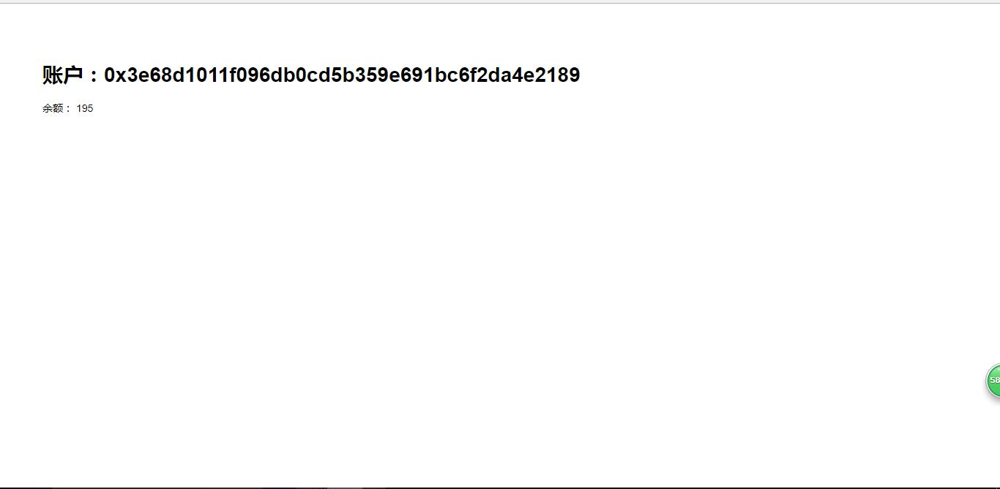

#Nodejs框架Express的使用
第一课中我们只使用了原生的Nodejs进行简单的数据抓取，只有两个数据，本节课主要介绍和后续开发Dapp有关的Express的知识。
##安装使用Express
shift+鼠标右键打开后，选择在此处打开cmd命令窗口。以下命令均使用此类方法输入。第一课中nodejs的版本稍低，现在一般下载的版本都在6.9.5v以上。使用命令全局安装Express框架：
	
	npm install express -g 
查看是否安装成功,显示版本号说明安装成功：
   
    express --version
     4.14.1
想学习Express的详细课程请参考官网：[http://www.expressjs.com.cn/](http://www.expressjs.com.cn/ "Express官方网站")

或者查看Express4.x-API详细手册： [http://www.expressjs.com.cn/4x/api.html](http://www.expressjs.com.cn/4x/api.html "Express4.x-API详细手册")

初始化一个Express项目，并使用ejs模版引擎,依次执行以下命令：

    express -e Dapp
	cd Dapp&&npm install
	npm start
我们会得到一个项目，其目录为：

		| 目录结构 | 文件说明           
		|------ |:-------------:
		| bin | 存放启动项目的脚本文件，默认www 
		| node_modules | 存放所有的项目依赖库，默认body-parser、cookie-parser、debug、jade、express、morgan、serve-favicon。      
		| bodyParser | 用于解析客户端请求的body中的内容，内部使用JSON编码处理,，url编码处理以及对于文件的上传处理。
	    | cookieParser | 中间件用于获取web浏览器发送的cookie中的内容
		| debug | 小的调试工具，打印的是开发者自己在 控制台 打印的信息      
		| morgan |打印的nodejs 服务器接受到的请求的信息
	    | serve-favicon | favicon服务中间件和缓存
		| public | 静态资源文件夹，默认images、javascripts、stylesheets
		| routes | 路由文件相当于MVC中的Controller，默认index.js、users.js
		| views | 页面文件，相当于MVC中的view，Ejs模板或者jade模板，默认error.jade、index.jade、layout.jade	
		| package.json | 项目依赖配置及开发者信息。	
		| app.js | 应用核心配置文件，项目入口，相当于php项目中的 index.php、index.html。	
有关目录的分析请参考：[http://blog.csdn.net/lu1024188315/article/details/51986224](http://blog.csdn.net/lu1024188315/article/details/51986224 "Express项目目录分析")

打开浏览器，输入localhost:3000,页面正常显示，安装成功，马上就可以开始做项目啦，请nodejs大神忽略我这些无聊的教程：

下面是一个小技巧，因为一般的ejs模版引擎的后缀是.ejs,在app.js中相关设置的地方是：

	app.set('views', path.join(__dirname, 'views'));
	app.set('view engine', 'ejs');
我们只需要稍作修改就可以，换回我们熟悉的.html文件，但是仍然可以使用ejs模版引擎的语法：

	app.set('views', path.join(__dirname, 'views'));
	app.engine('html',ejs.__express);
	app.set('view engine', 'html');
ejs模版引擎的语法和使用请参考：[http://www.embeddedjs.com/](http://www.embeddedjs.com/ "EJS官网")或者百度，有很多参考资料，这里就不赘述。

为了使项目模块化，一个小项目，建议使用一个路由文件，路由文件设置在app.js中：

	var index = require('./routes/index');
	var users = require('./routes/users');

如果后期我们需要添加其他项目时，我们可以添加别的路由文件：

	var datacageindex = require('./routes/datacageindex');
	var datacageusers = require('./routes/datacageusers');
	var reputationindex = require('./routes/reputationindex');
	var reputationusers = require('./routes/reputationusers');
	var tokenScoreindex = require('./routes/tokenScoreindex');
	var tokenScoreusers = require('./routes/tokenScoreusers');
##使用Express框架实现账户余额的页面显示

###1.添加web3模块###
web3模块前面也讲过，它是与以太坊互动的api。所以建立以太坊项目，必须添加这个模块，在你的项目目录中,-save 是将此模块作为必要依赖写入package.json文件中。
	
	cd app
	npm install -save web3

###2.修改routes/index路由文件
现在的路由文件如下代码：	

	var express = require('express');
	var router = express.Router();
	/* GET home page. */
	router.get('/', function(req, res, next) {
	  res.render('index', { title: 'Express' });
	});
	module.exports = router;
他将"express"字符串作为参数，交给title，然后返回给页面views/index.ejs
	
	<!DOCTYPE html>
	<html>
	  <head>
	    <title><%= title %></title>
	    <link rel='stylesheet' href='/stylesheets/style.css' />
	  </head>
	  <body>
	    <h1><%= title %></h1>
	    
Welcome to <%= title %>

	  </body>
	</html>

现在我们添加和以太坊的交互代码：

	var express = require('express');
	var router = express.Router();
	//引用web3模块
	var Web3 = require('web3');
	//创建web3实例
	var web3 = new Web3();
	//创建http连接到区块链
	web3.setProvider(new web3.providers.HttpProvider('http://localhost:8545'));
	//获得区块链主账户
	/* GET home page. */
	router.get('/', function(req, res, next) {
	  var account = web3.eth.accounts[0];
	//获取帐号的余额，使用的固定web3的api，参考相关文档
	  var balance = web3.fromWei(web3.eth.getBalance(web3.eth.accounts[0]),'ether');
	  res.render('index', { account: account ,balance:balance});
	});
	module.exports = router;

页面的代码需要修改一下，配合路由文件

	<!DOCTYPE html>
	<html>
	  <head>
	    <title>账户余额</title>
	    <link rel='stylesheet' href='/stylesheets/style.css' />
	  </head>
	  <body>
	    <h1>账户是：<%= account %></h1>
	    
余额是：<%= balance %>

	  </body>
	</html>

最后再输入localhost:3000 查看页面,显示为如下：
