#智能合约的编写和使用#
目前在以太坊应用开发中，应用最广泛的智能合约编程语言是solidity。智能合约的调用过程：当我们部署好智能合约，需要记录下abi(二进制)和合约地址。通过web3.eth.contract(abi).at(address)
学习solidity最好的网站就是官方网站。    
solidity官方文档：[https://solidity.readthedocs.io/en/develop/](https://solidity.readthedocs.io/en/develop/ "solidity官方开发文档")  
区块链技术博客：[http://me.tryblockchain.org/](http://me.tryblockchain.org/ "区块链技术博客")
##一、智能合约的开发环境搭建 ##
###1.安装sublime text3###
1.下载软件：[https://www.sublimetext.com/3](https://www.sublimetext.com/3 "Sublime Text 3")  
2.输入注册码：[http://blog.163.com/jinwei_zhiyuan/blog/static/115822652016424114451186/](http://blog.163.com/jinwei_zhiyuan/blog/static/115822652016424114451186/ "注册码") 
3.安装汉化包，在首选项中，选择Package Control 再选择 Install Package，会反应一段时间，出现一个输入框，如图：
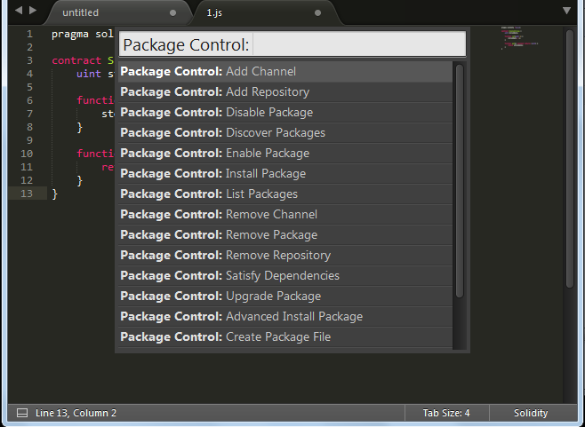

输入Chinese,会出现ChineseLocations第一个选项，我这个已经安装好了，所以没出来。等待安装完毕以后，软件的菜单会变成中文

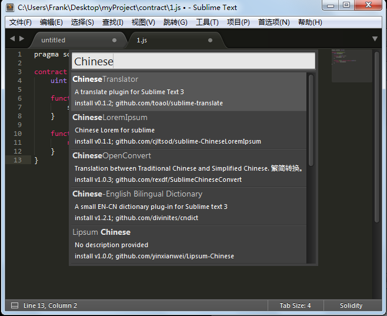

4.安装solidity插件：与以上步骤相同，进入Install Package输入界面，输入Ethereum 会看到第一个选项solidity选择，开始安装。

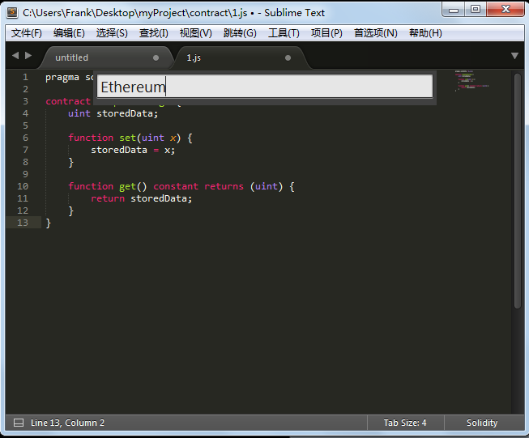

5.安装完成后就可以写solidity 文件了

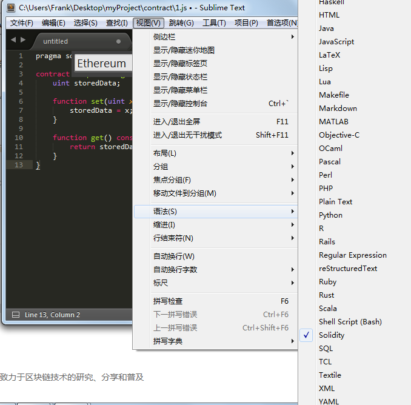
##二、solidity编写智能合约的基础知识##
Solidity （中文：固态，固体）是一种语法与Javascript相似的高级语言，它为Ethereum虚拟机编译代码而设计。 本教程对Solidity提供入门介绍，通常认为读者已有虚拟机和编程方面的基础。更多细节请参阅Solidity规范（仍在编写中）。该教程没有涵盖一些诸如自然语言文档或形式证明等特点，也并不意味这是最终的语言规范。你可以开始在浏览器里开始使用solidity，无需下载或编译任何东西。此应用仅支持编译——如果你想运行代码或注入到blockchain，你要使用类似AhethZero的客户端。简单例子：

	contract SimpleStorage {
	   uint storedData;
	   function set(uint x) {
		  storedData = x;
	   }
	   function get() constant returns (uint retVal) {
		  return storedData;
	   }
	}
Uint storedData声明了一个uint类型（256位无符号整数）的名为storedData的状态变量，其在存储器的位置由编译器自动分配。set和get函数用于修改和获得该变量的值。子货币例子：

	contract Coin {
	    address minter;
	    mapping (address => uint) balances;
	    function Coin() {
	        minter = msg.sender;
	    }
	    function mint(address owner, uint amount) {
	        if (msg.sender != minter) return;
	        balances[owner] += amount;
	    }
	    function send(address receiver, uint amount) {
	        if (balances[msg.sender] < amount) return;
	        balances[msg.sender] -= amount;
	        balances[receiver] += amount;
	    }
	    function queryBalance(address addr) constant returns (uint balance) {
	        return balances[addr];
	    }
    }

这个合约引入了一些新的概念。其中之一是address类型，这是一个不允许有任何算术运算的160位的值。此外，状态变量balance是一个复杂的数据类型，它映射address到无符号整数。映射可以被看作是哈希表，在实际初始化后，每一个可能存在的键都被映射到一个字节表示是全零的值。Coin这个特别的函数是构造函数，在合约被创建时运行，并且以后不能被调用。它永久存储这个合约创建人的地址。同tx和block一起，msg是一个神奇的全局变量，包含了一些属性，允许合约访问外部世界。函数queryBalance被声明为constant（常量类型），并且因此不允许修改合约的状态（注意，虽然尚未强制执行）。在Solidity中，返回“参数”被是命名的，本质上即建立一个局部变量。所以返回balance时，我们只需使用bal = balance[addr]; 没有任何return语句。
###1.注释###
单行注释（//）和多行注释（/*...*/）都是可以的，而在函数声明前的三斜线注释（///）要引入NatSpec注释（不属于这里的讨论范围）。
###2.类型###
目前实现的（基本）类型有布尔(bool)，整数和固定长度的字符串（从string0到string32）类型。整数类型有不同位长的符号型和无符号型（从int8/uint8到int256/uint256，步长为8位。其中uint/int是uint256/ int256的别名），散列=hash（从hash8到hash256，步长为8位 hash是hash256的别名）及地址= addresses（160位）。 
###3.数值运算###
(<=, !=,==,等)的比较最终会产生布尔型（booleans），而布尔型（booleans）可以用&&, || 和 !连接起来。通常的短路原则也适用于&& 和 ||，也就是说(0 < 1 ||fun()) 这样的形式的表述的话，函数func（）永远不会被调用。因为0<1永远是返回true，所以 || 后面的结果无论如何都是返回true，这样 || 后面的语句不会被执行。如果操作符被应用到不同类型的整数，所述编译器试图隐式的转换操作数中的一个到另一个的类型（对于代入也是如此）。在一般情况下，如果在语义上讲得通，并且不丢失任何信息的话，隐式转换是可能的：uint8可以转换为uint16，int120到int256，但int是无法转换为uint256。此外，无符号整数可以被转换为相同的或更大的散列，反之则不成立。任何可以转换到hash160的类型也可以转换为地址（address）类型。如果编译器不允许隐式转换，但如果责任自负的话，一个显式的类型转换有时也是可能的：

	int8 y = -3;
	uint x = uint(y);

在此代码段的末尾，x的值会是0xfffff..fd（64个16进制的字符），它－3在256位的二进制补码表示。为方便起见，并不总是需要明确的指定一个变量的类型，编译器会自动地从分配给该变量的第一个表达式的类型推断它的类型：

	hash x = 0x123;
	var y = x;
这里，y的类型将是散列。函数参数或返回参数是不能使用var的。整数字面值只要整数字面值与自己相结合，它的类型就没有被决定。最好用例子来解释：
var x = 1 - 2;1 - 2的值是-1，它被分配给x，因而x得到int8类型- 包含-1的最小类型。但是下面的代码片段的表现则有所不同：

	var one = 1;
	var two = 2;
	var x = one - two;
这里，1和2都是unit8类型，其也被传递给x。在unit8（无符号，非负数）里的减法将会导致“绕回”，因此x的值将是255。只要整数字面值仅被用于计算那么它暂时超过最大的256位也是可能的：

    var x = (0xffffffffffffffffffff * 0xffffffffffffffffffff) * 0;

这里，x的值将为0，因此类型为unit8。以太货币单位“Wei”、“Finneny”、“Szabo”、“Ether”等字面数字可以作为子货币面额的后缀，无后缀的数字被视为是Wei，如 : 2 Ether==2000Finney,判别为真。

		【译注】：
		wei ：音译为“微、卫、伟等”（后文中取“微”），Ethereum中最小货币面额单位，等同于Bitcoin的聪，类似美元中的美分，
		英镑中的便士；
		10^3: Kwei，千微。
		10^6: Mwei，百万微。
		10^9: Gwei，十亿微。
		10^12: szabo，取自Nick Szabo，译为“萨博”，简称“萨”。
		10^15: finney，取自Hal Finney，译为“芬尼”，简称“芬”。
		10^18: ether，以太，以太币基本货币单位，类似人民币元，Bitcoin的BTC单位。
		10^21: Kether，待定。
		10^24: Mether，待定。
		10^27: Gether，待定。
		10^30: Tether，待定。
		10^33: Pether，待定。
		10^36: Eether，待定。
		10^39: Zether，待定。
		10^42: Yether，待定。
		10^45: Nether，待定。
		10^48: Dether，待定。
		10^51: Vether，待定。
		10^54: Uether，待定。

###4.控制结构###
大多数C和JavaScript的控制结构都可以用在solidity里，除了switch(未计划)还有goto（貌似不严谨）。所以下列控制结构时可用的：if, else, while, for, break, continue, return。注意不像在C和JavasScript里，Solidity里没有从非布尔型转换布尔型的类型转换，所以if(1)在Solidty里是无效的。

###5.函数调用###
目前合约的函数，可以直接也可以递归的被调用，如在本示例（代码本身无意义）所显示的：

	contract c {
	  function g(uint a) returns (uint ret) { return f(); }
	  function f() returns (uint ret) { return g(7) + f(); }
	}

这个表达式this.g(8)也是一个有效的函数调用，但这次功能是直接通过消息调用而非通过直接跳转。当调用其它合约的功能时，一定数额的“微”和可被定义的“瓦斯”（译注:Ethereum针对bitcoin交易的一项改进）随调用一起发送。

	contract InfoFeed {
	  function info() returns (uint ret) { return 42; }
	}
	contract Consumer {
	  InfoFeed feed;
	  function setFeed(address addr) { feed = InfoFeed(addr); }
	  function callFeed() { feed.info.value(10).gas(800)(); }
	}

请注意表达式infoFeed（addr）执行了一个明确类型转换，声明“我们知道这类合约在给定的地址infoFeed”，过程中无构造函数在运行。需要注意的是在feed.info.valu(10).gas(800)中，仅需（本地）设置随函数调用发送的数值和瓦斯数量，最后括号内(的语句)得到确定的执行调用。函数调用自变量（在返回时）也被依序赋予名称：

	contract c {
		function f(uint key, uint value) { ... }
		function g() {
		  f({value: 2, key: 3});
		}
	}

函数参数的名称和返回参数是都可选的。

	contract test {
	  function func(uint k, uint) returns(uint){
	    return k;
	  }
	}

特别变量和函数一些特别变量和函数已收入在全局命名空间里。

	Block and Transaction Properties
	块和资产交易
	• block.coinbase (address): current block miner's address
	当前块的矿工地址
	• block.difficulty (uint): current block difficulty
	当前块难度定义
	• block.gaslimit (uint): current block gaslimit
	当前块的瓦斯限额
	• block.number (uint): current block number
	当前块数字标识
	• block.blockhash (function(uint) returns (hash)): hash of the given block
	获取给定块的散列Hash
	• block.timestamp (uint): current block timestamp
	当前块的时间戳
	• msg.data (bytes): complete calldata
	完整的调用数据
	• msg.gas (uint): remaining gas
	剩余的瓦斯值
	• msg.sender (address): sender of the message (current call)
	消息发送函数（当前调用）
	• msg.value (uint): number of wei sent with the message
	随消息发送的交易费数值，以wei（微）计量。
	• tx.gasprice (uint): gas price of the transaction
	完成交易的瓦斯价格
	• tx.origin (address): sender of the transaction (full call chain)
	交易发送函数（全链调用？）

###6.秘钥函数###

	• sha3(...) returns (hash): compute the SHA3 hash of the (tightly packed) arguments
	计算SHA3散列,紧凑排列
	• sha256(...) returns (hash): compute the SHA256 hash of the (tightly packed) arguments
	计算SHA256散列,紧凑排列
	• ripemd160(...) returns (hash160): compute RIPEMD of 256 the (tightly packed) arguments
	计算RIPEMD160散列,紧凑排列
	• ecrecover(hash, hash8, hash, hash) returns (address): recover public key from elliptic curve signature
	从椭圆曲线签名中恢复公钥

上述“紧凑”意味着自变量是无间隔连接着的，例：

	sha3("ab", "c") == sha3("abc") == sha3(0x616263) == sha3(6382179) = sha3(97, 98, 99).
如果需要间隔，会用到特定类型转换。合约相关

	• this (current contract's type): the current contract, explicitly convertible to address
指定当前合约，明确可转换的地址

	• suicide(address): suicide the current contract, sending its funds to the given address
消除当前合约，发送其资金到给定地址；而且，当前合约的所有函数都是直接可调用的，包括当前函数。地址相关函数查询某一地址的余额可用属性balance ，或以send发送以太币（以Wei为单位）到一地址。

	address x = 0x123;
	if (x.balance < 10 && address(this).balance >= 10) x.send(10);

而且，与合约的接口不能依附于ABI（如传统的NameReg合约），函数调用会获得一个任意类型变量的任意数值。这些自变量是ABI的序列化 （如：也填充到32bytes）。一个异常情况是首自变量仅是4bytes编码。这种情况下，并不是以填充(位数)允许签名函数在此应用。

	address nameReg = 0x72ba7d8e73fe8eb666ea66babc8116a41bfb10e2;
	nameReg.call("register", "MyName");
	nameReg.call(string4(string32(sha3("fun(uint256)"))), a);

注意合约继承了所有地址成员，有可能使用this.balance来查询当前合约的余额。表达式的评估命令表达式评估的指令并未特别指定（更正式说，在表达式树中子节点的评估指令是未指定的，但这些当然是在节点自身之前就评估了的）。能确保的是顺序语句执行和布尔型短路表达式是可以的。

###7.构造类型###
Solidity提供一种以structs形式构造新类型的方法，如下例所示。

	contract CrowdFunding {
	  struct Funder {
	    address addr;
	    uint amount;
	  }
	  struct Campaign {
	    address beneficiary;
	    uint fundingGoal;
	    uint numFunders;
	    uint amount;
	    mapping (uint => Funder) funders;
	  }
	  uint numCampaigns;
	  mapping (uint => Campaign) campaigns;
	  function newCampaign(address beneficiary, uint goal) returns (uint campaignID) {
	    campaignID = numCampaigns++; // campaignID is return variable
	    Campaign c = campaigns[campaignID];  // assigns reference
	    c.beneficiary = beneficiary;
	    c.fundingGoal = goal;
	  }
	  function contribute(uint campaignID) {
	    Campaign c = campaigns[campaignID];
	    Funder f = c.funders[c.numFunders++];
	    f.addr = msg.sender;
	    f.amount = msg.value;
	    c.amount += f.amount;
	  }
	  function checkGoalReached(uint campaignID) returns (bool reached) {
	    Campaign c = campaigns[campaignID];
	    if (c.amount < c.fundingGoal)
	      return false;
	    c.beneficiary.send(c.amount);
	    c.amount = 0;
	    return true;
	  }
	}

合约中不提供一个众筹合约的全部功能，但可以包含一些有必要理解构造类型的基本概念。构造类型可被用来作为值类型的映射也可自身包含映射（甚至构造类型自身能作为映射的值类型，尽管它不可能在自身内部包括一个构造类型）。注意如何在众多的函数中，实现一个构造类型被指定到一个本地变量。这不是拷贝结构，而仅是储存一个引用，以指向本地变量成员并确切写入其状态。与其它合约的接口有两种方式与其它合约实现接口：Ether调用一个方法，返回一个地址已知的合约或创建一个新合约。全部使用方法如下例所示。注意
（明显地）待创建合约的源代码应是已知的，也就是说，被创建合约在创建之前就已有实现（循环依赖不可能出现，因新合约字节码是明确包含在待创建合约之中的）。

	contract OwnedToken {
	  // TokenCreator is a contract type that is defined below. It is fine to reference it
	  // as long as it is not used to create a new contract.
	  TokenCreator creator;
	  address owner;
	  string32 name;
	  function OwnedToken(string32 _name) {
	    address nameReg = 0x72ba7d8e73fe8eb666ea66babc8116a41bfb10e2;
	    nameReg.callstring32string32("register", _name);
	    owner = msg.sender;
	    // We do an explicit type conversion from `address` to `TokenCreator` and assume that the type of
	    // the calling contract is TokenCreator, there is no real way to check.
	    creator = TokenCreator(msg.sender);
	    name = _name;
	  }
	  function changeName(string32 newName) {
	    // Only the creator can alter the name -- contracts are explicitly convertible to addresses.
	    if (msg.sender == address(creator)) name = newName;
	  }
	  function transfer(address newOwner) {
	    // Only the current owner can transfer the token.
	    if (msg.sender != owner) return;
	    // We also want to ask the creator if the transfer is fine.
	    // Note that this calls a function of the contract defined below.
	    if (creator.isTokenTransferOK(owner, newOwner))
	      owner = newOwner;
	  }
	}
	contract TokenCreator {
	  function createToken(string32 name) returns (address tokenAddress) {
	    // Create a new Token contract and return its address.
	    return address(new OwnedToken(name));
	  }
	  function changeName(address tokenAddress, string32 name) {
	    // We need an explicit type conversion because contract types are not part of the ABI.
	    OwnedToken token = OwnedToken(tokenAddress);
	    token.changeName(name);
	  }
	  function isTokenTransferOK(address currentOwner, address newOwner) returns (bool ok) {
	    // Check some arbitrary condition.
	    address tokenAddress = msg.sender;
	    return (sha3(hash160(newOwner)) & 0xff) == (hash160(tokenAddress) & 0xff);
	  }
	}

构造函数自变量，一个Solidity合约需要构造器自变量之后的合约数据，这意味着在通用的ABI格式中，你可以将合约数据放在编译的字节后作为返回值，以此对合约传递自变量。

###8.合约继承###
通过包括多态在内的代码拷贝，Solidity支持多级继承。实现细节如下示例。

	contract owned {
	    function owned() { owner = msg.sender; }
	    address owner;
	}
	
	// Use "is" to derive from another contract. Derived contracts can access all members
	// including private functions and storage variables.
	contract mortal is owned {
	    function kill() { if (msg.sender == owner) suicide(owner); }
	}
	
	// These are only provided to make the interface known to the compiler.
	contract Config { function lookup(uint id) returns (address adr) {} }
	contract NameReg { function register(string32 name) {} function unregister() {} }
	
	// Multiple inheritance is possible. Note that "owned" is also a base class of
	// "mortal", yet there is only a single instance of "owned" (as for virtual
	// inheritance in C++).
	contract named is owned, mortal {
	    function named(string32 name) {
	        address ConfigAddress = 0xd5f9d8d94886e70b06e474c3fb14fd43e2f23970;
	        NameReg(Config(ConfigAddress).lookup(1)).register(name);
	    }
	
	// Functions can be overridden, both local and message-based function calls take
	// these overrides into account.
	    function kill() {
	        if (msg.sender == owner) {
	            address ConfigAddress = 0xd5f9d8d94886e70b06e474c3fb14fd43e2f23970;
	            NameReg(Config(ConfigAddress).lookup(1)).unregister();
	// It is still possible to call a specific overridden function. 
	            mortal.kill();
	        }
	    }
	}
	
	// If a constructor takes an argument, it needs to be provided in the header.
	contract PriceFeed is owned, mortal, named("GoldFeed") {
	   function updateInfo(uint newInfo) {
	      if (msg.sender == owner) info = newInfo;
	   }
	
	   function get() constant returns(uint r) { return info; }
	
	   uint info;
	}

注意如上的示例，我们调用mortal.kill()以“转发”析构请求。已完成的方法是有些问题的，详见如下示例：

	contract mortal is owned {
	    function kill() { if (msg.sender == owner) suicide(owner); }
	}
	contract Base1 is mortal {
	    function kill() { /* do cleanup 1 */ mortal.kill(); }
	}
	contract Base2 is mortal {
	    function kill() { /* do cleanup 2 */ mortal.kill(); }
	}
	contract Final is Base1, Base2 {
	}

对final.kill()调用将调用base2.kill作为派生重载，但这函数将绕开Base1.kill, 基本上因为它甚至不知道Base1.这种情况下应使用super:

	contract mortal is owned {
	    function kill() { if (msg.sender == owner) suicide(owner); }
	}
	contract Base1 is mortal {
	    function kill() { /* do cleanup 1 */ super.kill(); }
	}
	contract Base2 is mortal {
	    function kill() { /* do cleanup 2 */ super.kill(); }
	}
	contract Final is Base1, Base2 {
	}

如果Base1调用一个super的函数，它不是简单在其中一个合约之上调用该函数，相当于在在最终继承图谱中的下一个合约调用该函数，所以将会有Base2.kill()的调用。注意确切的函数调用是在不知道类中何处使用的上下文环境中使用super，尽管它的类型是已知的。这也类似于虚方法查找函数lookup。

###9.多级继承和线性化###
Solidity语言允许多级继承以处理一些问题，一部分已在 Diamond Problem中。Solidity跟随了Python的路径并使用"C3 Linearization"以强制指定一个基类的DAG中的特定指令。这导致了单调性的预期的属性，但排斥了另一些继承图谱（路径）。特别地，基类中如已给出的指令 is 是重要的。接下来的代码中，Solidity给出了"不可能实现的继承图谱线性化"错误示例。

	contract X {}
	contract A is X {}
	contract C is A, X {}

原因是C请求X重载A（指定A，X在这条指令中），但A自身需要重载X，这也是不可解决的矛盾之处。一个便于记忆的简单规则是：从“基类相近”到“多层派生”的次序指定基类。

###10.关于可视性的修饰界定符###
函数和存储变量可被如public, protected, private,修饰和界定，默认的函数修饰符是public，默认的变量修饰符是protected。Public函数是外部接口的一部分，可以被外部调用，而存储变量由一个自动存取器函数生成。非公开函数仅对内部合约和由其派生的合约可见（现在protected和private间则没有明显的区别）。

	contract c {
	  function f(uint a) private returns (uint b) { return a + 1; }
	  function setData(uint a) inherited { data = a; }
	  uint public data;
	}

外部合约可以调用c.data()以获取在存储中的数值，但不能调用f。

###11.存取器功能###
编译器自动化创建对所有公共状态变量的存取访问器函数。如下给出的合约有名为data的函数而不占用任何自变量并返回一个无符号整型数(uint)，即状态值变量data。

	contract test {
	    function test() {
	        data = 42;
	    }
	    uint public data;
	}

接下来的例子有点难度：

	contract complex {
	  struct Data { uint a; string3 b; mapping(uint => uint) map; }
	  mapping(uint => mapping(bool => Data)) public data;
	}

将生成一个如下格式的函数：

	function data(uint arg1, bool arg2) returns (uint a, string3 b)
	{
	  a = data[arg1][arg2].a;
	  b = data[arg1][arg2].b;
	}

注意在结构中的映射是被忽略的，因为没有好的方法为映射提供键值。

###12.回滚函数###
一个合约可以有一个未命名函数。这个函数不能带自变量，在无其它函数适配给定的函数标识符时，调用该合约函数执行（或没有任何数据提供时执行）。

	contract Test {
	  function() { x = 1; }
	  uint x;
	}
	contract Caller {
	  function callTest(address testAddress) {
	    Test(testAddress).send(0);
	    // results in Test(testAddress).x becoming == 1.
	  }
	}

###13.函数修饰器###
函数行为修正函数修饰器可以用来容易地变更函数的行为，举例来说，对执行中的函数进行一种在先执行条件的自动化检测。他们是合约可继承的属性，亦可被派生合约重载。

	contract owned {
	  function owned() { owner = msg.sender; }
	  address owner;
	
	  // This contract only defines a modifier but does not use it - it will
	  // be used in derived contracts.
	  // The function body is inserted where the special symbol "_" in the
	  // definition of a modifier appears.
	  modifier onlyowner { if (msg.sender == owner) _ }
	}
	contract mortal is owned {
	  // This contract inherits the "onlyowner"-modifier from "owned" and
	  // applies it to the "kill"-function, which causes that calls to "kill"
	  // only have an effect if they are made by the stored owner.
	  function kill() onlyowner {
	    suicide(owner);
	  }
	}
	contract priced {
	  // Modifiers can receive arguments:
	  modifier costs(uint price) { if (msg.value >= price) _ }
	}
	contract Register is priced, owned {
	  mapping (address => bool) registeredAddresses;
	  uint price;
	  function Register(uint initialPrice) { price = initialPrice; }
	  function register() costs(price) {
	    registeredAddresses[msg.sender] = true;
	  }
	  function changePrice(uint _price) onlyowner {
	    price = _price;
	  }
	}

对一个函数来说，多级修饰器也是可以接受的，通过在一个以空格分开的列表中指定它们即可，对多级修饰也是按指定顺序进行评估的。当一个函数或修饰器运行到末端的控制流会继续运行接续其后的“_”在先修饰器，从一个修饰器或函数内当即运行出函数体从而产生确定的返回值。对修饰器自变量和上下文中而言，任意表达式是允许的，所有在函数内可见的符号对修饰器也可见，而引入修饰器的符号在函数中却是不可见的（他们也可以通过重载改变）。

###14.事件###
事件允许EVM日志工具的方便使用。事件是合约对象的可继承的成员。当被调用时，由事件引发的自变量存储在交易日志中。共有三个参数可以接收indexed属性，其引发了被视为日志标题的各自的变量而非数据。事件的签名散列也是其中一个标题。所有非索引的自变量将被储存在日志的数据部分。如下示例：

	contract ClientReceipt {
	  event Deposit(address indexed _from, hash indexed _id, uint _value);
	  function deposit(hash _id) {
	    Deposit(msg.sender, _id, msg.value);
	  }
	}

这里，对Deposit调用将表现在对log3(msg.value,0x50cb9fe53daa9737b786ab3646f04d0150dc50ef4e75f59509d83667ad5adb20, sha3(msg.sender), _id)的调用中;.注意最大的16进制数等于"Deposit(address,hash256,uint256)" 的sha3散列，即事件的签名。

###15.存储布局###
有限大小的变量(除映射类型外的一切类型)在存储上是从位置0开始被相邻布局的。由于有不可预计的大小，映射类型是用sha3计算以找到
数值的所在位置，方法如下：根据上述规则（或从映射到映射递归地应用这个规则），映射自身在存储中占据一个（未填充的）地址槽
指向一个p指针位置，相应的键值k则定位在与sha3(k,p)有连接之处。如果值还是非元素类型，那么其位置通过增加一个sha3(k,p)位移
可得。于是有如下的合约代码段：

	contract c {
	  struct S { uint a; uint b; }
	  uint x;
	  mapping(uint => mapping(uint => S)) data;
	}

data[4][9].b这个数据位于sha3(uint256(9).sha3(uint256(4).uint(256(1)))+1。

###16.秘密特性###
有一些类型在Solidity的类型体系中语法上没有可对应之物。其中之一是函数类型。但仍可使用var 获得这些类型的本地变量：

	contract FunctionSelector {
	  function select(bool useB, uint x) returns (uint z) {
	    var f = a;
	    if (useB) f = b;
	    return f(x);
	  }
	  function a(uint x) returns (uint z) {
	    return x * x;
	  }
	  function b(uint x) returns (uint z) {
	    return 2 * x;
	  }
	}

调用select(false, x) 将计算x*x，调用select(true, x) 将计算2*x. 
##三、合约的使用方法 ##
###1.编写示例合约###
这是一个简单数据存储器，相当于solidity的helloWorld程序。

	contract SimpleStorage {
	  uint storedData;
	  function set(uint x) {
		storedData = x;
	  }
	  function get() constant returns (uint retVal) {
		return storedData;
	  }
	}
###2.编译部署合约
智能合约的使用有三种方法,一种是使用solc在控制台中编译（不好使，可以不研究，除非你自己写合约部署程序），一种是在Mist钱包中部署(如果部署代币合约首推此方法)，另一种最推荐的方法是在线编译。solidity在线编辑编译器，Remix。其中v0.4.10是编译器的版本号，可以更换。有时候网站反映很慢：
[https://ethereum.github.io/browser-solidity/#version=soljson-v0.4.10+commit.60cc1668.js](https://ethereum.github.io/browser-solidity/#version=soljson-v0.4.10+commit.60cc1668.js "Remix")

1.将solidity代码粘贴在中间的代码列中。右侧就会对其进行自动编译，而且可以模拟运行其中的方法，这种测试合约的方式最方便最直观。
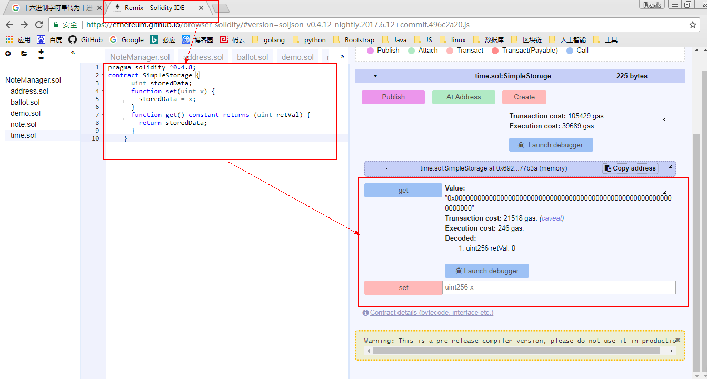
2.下面我们先在控制台部署此合约。其实部署合约只需拷贝下图箭头所指的web3 deploy里的代码到geth console中回车等待返回交易hash和合约地址address。

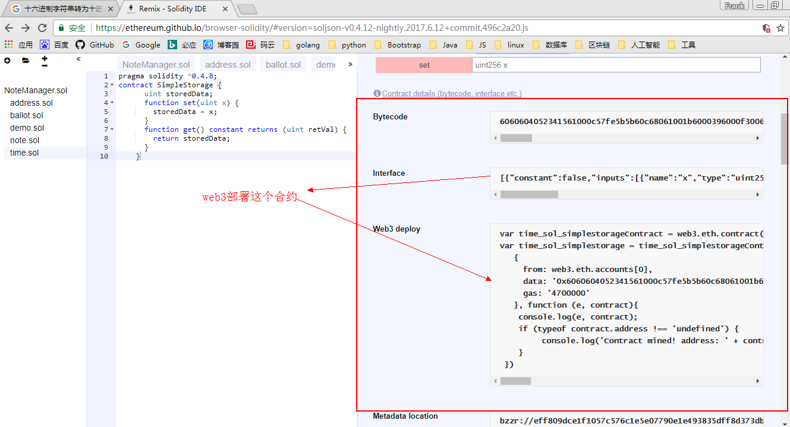

稍微修改一下变量名，方法调用时比较方便一些，部署之前先要解锁部署合约的账户，想部署成功必须要开启挖矿miner.start(),然后执行以下代码，等待返回结果，记录下来。

	//部署simplestorage合约，获得合约对象
	var simplestorageContract = web3.eth.contract([{"constant":false,"inputs":[{"name":"x","type":"uint256"}],"name":"set","outputs":[],"payable":false,"type":"function"},{"constant":true,"inputs":[],"name":"get","outputs":[{"name":"retVal","type":"uint256"}],"payable":false,"type":"function"}]);
	//通过合约对象，获得合约实例，进行真正的部署
	var simplestorage = simplestorageContract.new(
	   {
	     from: web3.eth.accounts[0], //合约拥有人，部署前需要解锁
		 //合约的Bytecode，是合约代码的十六进制数据
	     data: '0x6060604052341561000c57fe5b5b60c68061001b6000396000f30060606040526000357c0100000000000000000000000000000000000000000000000000000000900463ffffffff16806360fe47b11460445780636d4ce63c146061575bfe5b3415604b57fe5b605f60048080359060200190919050506084565b005b3415606857fe5b606e608f565b6040518082815260200191505060405180910390f35b806000819055505b50565b600060005490505b905600a165627a7a72305820eff809dce1f1057c576c1e5e07790e1e493835dff8d373dbffe33e94c75e55420029', 
		 //部署合约要消耗的汽油量
	     gas: '4700000'
	   }, function (e, contract){
		//function(e,contract)是一个回调函数，当部署成功后
	    console.log(e, contract);
	    if (typeof contract.address !== 'undefined') {
	         console.log('Contract mined! address: ' + contract.address + ' transactionHash: ' + contract.transactionHash);
	    }
	 })

下图在控制台中的完整过程。需要记录下address和hash以后查询或者调用合约方法时可以使用。

	address: 0x5990696cb45aabbc92ff88197b5a1bd919e5ab3b 
	transactionHash: 0xadf28044654357dc1f28f3902a14ece9a22a204aa904a4ebe6bf161d0d9f3aaa

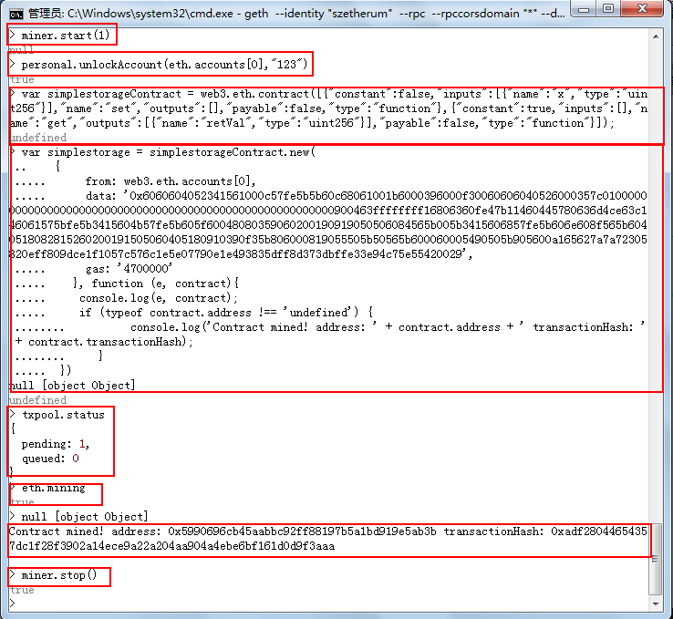

###4.合约方法的调用
这里我们只讲应用中使用的调用合约的方法。
1.首先获得合约实例：
	
	//合约的接口abi,interface
	var abi = [{"constant":false,"inputs":[{"name":"x","type":"uint256"}],"name":"set","outputs":[],"payable":false,"type":"function"},{"constant":true,"inputs":[],"name":"get","outputs":[{"name":"retVal","type":"uint256"}],"payable":false,"type":"function"}];
	var address = "0x5990696cb45aabbc92ff88197b5a1bd919e5ab3b"; //合约地址
	var simplestorage = web3.eth.contract(abi).at(address); //获得合约实例

实际操作如下图所示，而且只有两个方法，get和set方法。

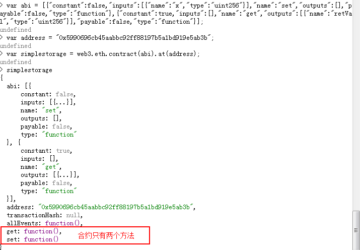

2.调用这两个方法，可以看到simplestorage属于非支付方法，不用发生交易就可以直接调用，但是set方法存数据必须发生交易，消耗一定的gas。

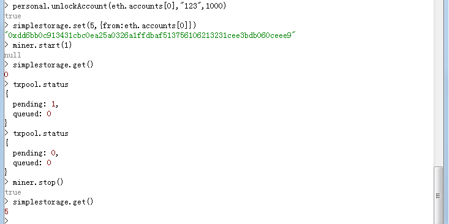

##四、使用Nodejs的Express完成以上操作 ##
本来这个简单的合约是不用一个框架来测试，但是我们最终是要用Express框架来开发Dapp，所以这是个由简入难的好例子。实现的功能大概就是在页面放两个按钮一个输入框，点击get按钮，显示存储的数据，输入一个数据，点击set，将此数据存入区块链。如果想重新做一个执行以下命令。
	
	1.express -e Dapp //创建一个ejs模版引擎的Dapp项目
	2.cd Dapp&&npm install //进入项目目录，添加依赖
	3.npm install -save web3 //添加web3模块
    4.npm start //启动项目测试安装是否成功

也可以接着前面的项目添加路由和页面组件就可以了。
###1.修改路由index.js文件全文如下
	var express = require('express');
	var router = express.Router();
	//引用web3模块
	var Web3 = require('web3');
	//创建web3实例
	var web3 = new Web3();
	//创建http连接到区块链
	web3.setProvider(new web3.providers.HttpProvider('http://localhost:8545'));
	//获得区块链主账户
	var User = require('../models/users');//导入模型数据模块
	//mongodb模块
	var mongoose = require('mongoose');
	mongoose.connect('mongodb://127.0.0.1:27017/datacage'); //连接到一个test的数据库
	//调用合约
	//合约的接口abi,interface
	var abi = [{"constant":false,"inputs":[{"name":"x","type":"uint256"}],"name":"set","outputs":[],"payable":false,"type":"function"},{"constant":true,"inputs":[],"name":"get","outputs":[{"name":"retVal","type":"uint256"}],"payable":false,"type":"function"}];
	var address = "0x5990696cb45aabbc92ff88197b5a1bd919e5ab3b"; //合约地址
	var simplestorage = web3.eth.contract(abi).at(address); //获得合约实例
	/* GET home page. */
	router.get('/', function(req, res, next) {
		//获取帐号
		 var account = web3.eth.accounts[0];
		//获取帐号的余额，使用的固定web3的api，参考相关文档
		  var balance = web3.fromWei(web3.eth.getBalance(web3.eth.accounts[0]),'ether');
		//从mongoos获取数据
		User.findByusername("XIAOWANG",function(err, user) {
	        if(err) {
	             console.log(err);
	         }
	         console.log(user);
		res.render('index', { account: account,balance:balance,user:user});
		});
		});
	//get方法调用智能合约simpleStorage.get方法来获取数据
	router.get('/get', function(req, res, next) {
		var simpleData = simplestorage.get();
		res.send({ simpleData: simpleData});
	});
	//set方法调用智能合约simpleStorage.set方法来设置数据
	router.post('/set', function(req, res, next) {
		var simpleData = req.body.simpleData;
		var account = web3.eth.accounts[0];
	    hash = simplestorage.set(simpleData,{from:account});
		res.send({hash:hash});
	});
	module.exports = router;

###2.修改页面文件index.ejs文件全文如下
尽量简单写，减少代码。

	<!DOCTYPE html>
	<html>
	<head>
	   <title>账户余额</title>
	   <link rel='stylesheet' href='/stylesheets/style.css' />
	</head>
	<body>
	   <h1>账户是：<%= account %></h1>
	   
余额是：<%= balance %>

	   <table>
	   	<tr>
	   		<td>姓名</td>
	   		<td>用户名</td>
	   		<td>部门</td>
	   		<td>职位</td>
	   		<td>电话</td>
	   		<td>账户地址</td>
	   	</tr>
	   	<tr>
	   		<td><%= user.name%></td>
	   		<td><%= user.username%></td>
	   		<td><%= user.company%></td>
	   		<td><%= user.position%></td>
	   		<td><%= user.phone%></td>
	   		<td><%= user.address%></td>
	   	</tr>
	   </table>
	   

	   <h1>点击上面的按钮在此处显示数据</h1>
	   输入数据：<input type="text" name="simpleData" id="simpleData"> 
	   <input type="button" value="SET" onclick="set()">&nbsp;&nbsp;&nbsp;&nbsp;<input type="button" value="GetData" onclick="get()">
	   <h1>点击set会返回交易hash</h1>	   
	   
	</body>
	</html>
页面展现如下图：
点击GetData获得数据5,填写一个新数据12,点击SET返回一个交易hash。在控制台查看txpool.status可以看到一个交易等待打包。然后启动挖矿打包此交易。
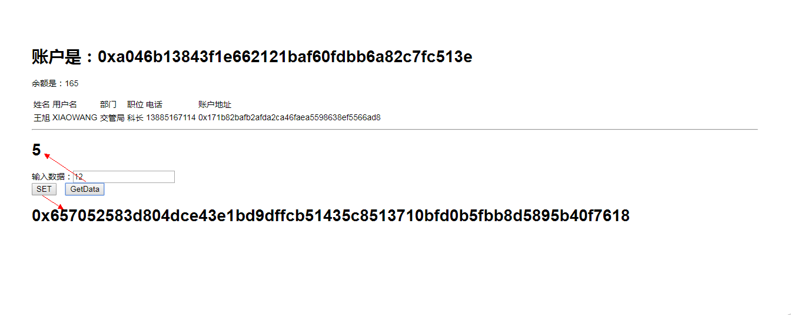
交易打包后，我们再次点击GetData会获得新的数据
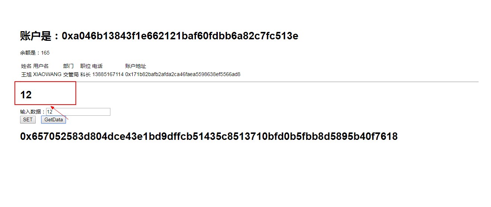

###3.总结
以上功能虽然很简单，但是已经梳理了一条路，一条通过nodejs+express+solidity的应用开发之路，剩下的更加有兴趣的功能需要我们去探索去完善。下一节会做一个积分交易的案例，页面稍微好看点，功能稍微多一点，有智能合约，有小型的区块浏览器。